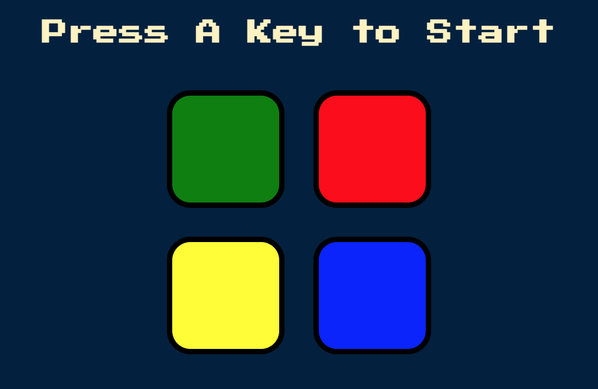

<h1>Simon Game</h1>
<h2>John Manouse</h2>

This is a game where you can test your memory skills.Once you press a colored key, the game is started. A sequence of colors will be displayed, and the object is to repeat the pattern. The first patterns will be easy, and become more difficult as the game progresses. Lights & sound accompany the game to make it more fun. Good Luck! 

 

<h2>Fun Game Design</h2>
<ul>
    <li>HTML</li>
    <li>CSS</li>
    <li>Javascript</li>
    <li>jQuery</li>
</ul>

<h2>Pull Requests welcome for contribution</h2>

John Manouse

Live Link: <a href="https://mirageg4.github.io/Simon-Game/">Simon Game</a>

Github: <a href="https://github.com/Mirageg4/Simon-Game">Pig Game</a>

 

License: Project is licensed under the MIT License. 
See <a href ="LICENSE.md">LICENSE</a> file for details.
